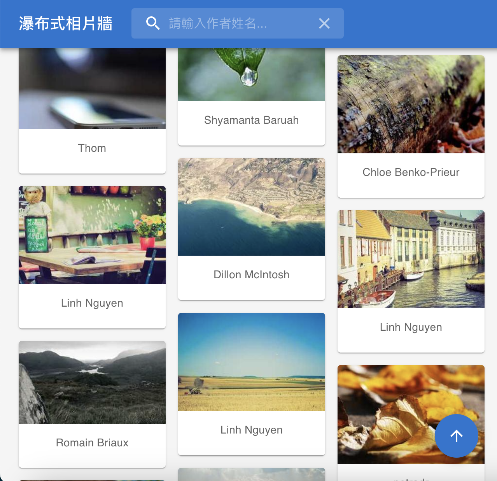
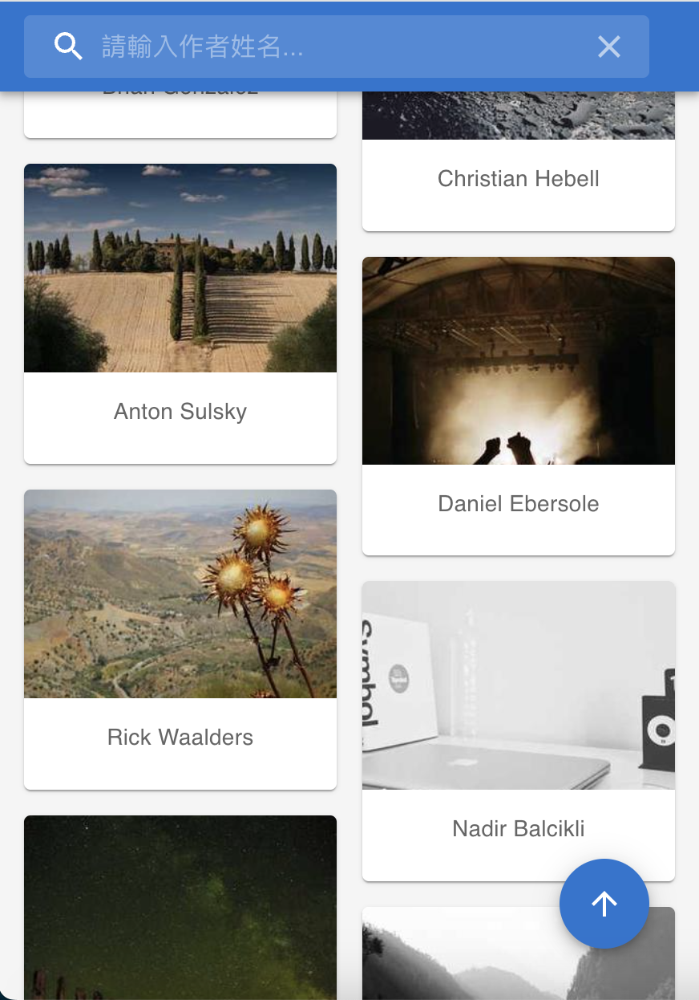
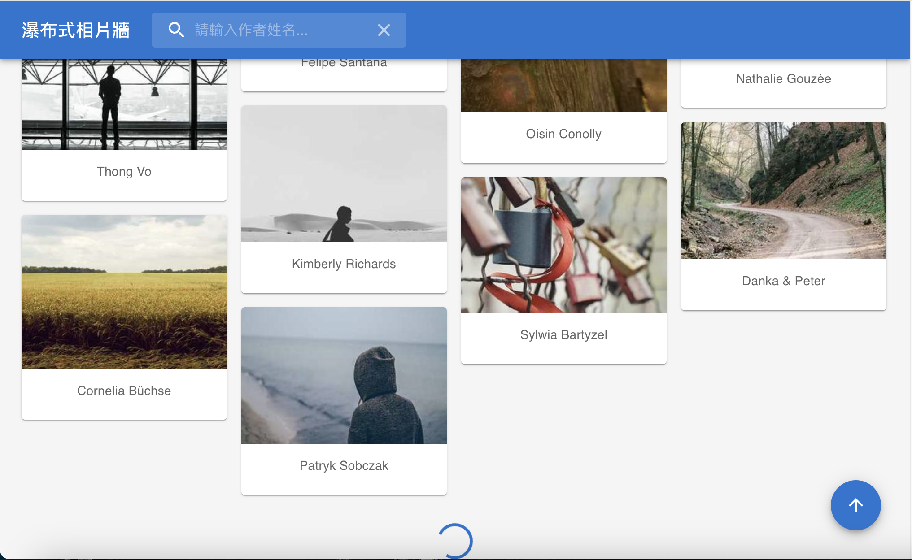
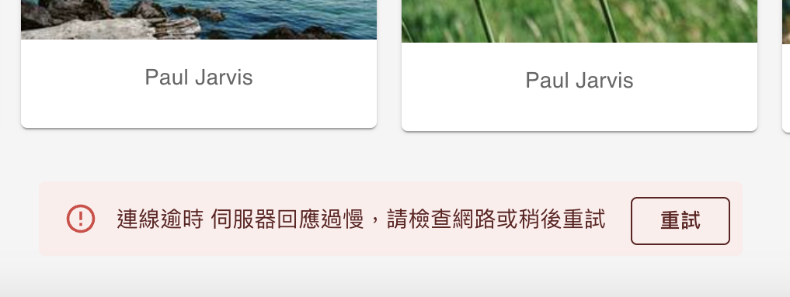

# 瀑布式相片牆

## 專案描述

此專案為一個瀑布式相片牆展示頁面，使用 React + TypeScript 開發的前端專案，整合 MUI 元件庫與 Ｍasonic 第三方庫，支援響應式排版與 lazy loading，使用 Picsum API 獲取圖片與展示，另外還包含：

- 使用 MUI 搭配自定義樣式進行排版
- 圖片動態載入與瀑布流排列
- 可透過作者名稱搜尋篩選圖片
- 流暢的使用體驗及互動提示

## 使用的前端技術及套件

- **Vite**：提供快速的開發體驗與模組熱更新。
- **React**：打造模組化 UI 架構。
- **TypeScript**：提升開發效率與型別安全。
- **MUI**：快速建立具有一致性設計語言的 UI。
- **Axios**：進行 API 資料擷取。
- **Tanstack Query (React Query)**：處理資料快取、同步與背景更新。
- **Masonic**：支援虛擬化的瀑布流排版套件。

## 安裝與啟動

- Node.js 版本需求：18+
- 本專案使用 [pnpm](https://pnpm.io/zh-TW) 建立。

1. Clone 專案：
   ```
   git clone git@github.com:BolasLien/waterfall-gallery.git
   ```
2. 安裝相依套件：
   ```
   pnpm install
   ```
3. 啟動開發模式：
   ```
   pnpm dev
   ```

## 說明

- 啟動服務，預設頁面是 http://localhost:5173/

- 支援 RWD，在不同裝置底下有不同欄位數量





- 支援一鍵滾動到頁面頂部


- 圖片資料獲取成功會先有 loading 效果，onLoad 後會有淡入效果。


- 滾動到頁面底部，會自動獲取更多圖片並顯示載入效果。



- 最後一頁時會顯示完成提示。


- 載入更多發生 api 錯誤時，會顯示錯誤提示。



- 搜尋欄位輸入資料時，相片牆會顯示相關作者名稱的圖片，清除搜尋欄位時，畫面會恢復完整相片牆


- 搜尋不到相片提示


- 第一次進入頁面載入提示


- 第一次進入頁面載入失敗時提示


